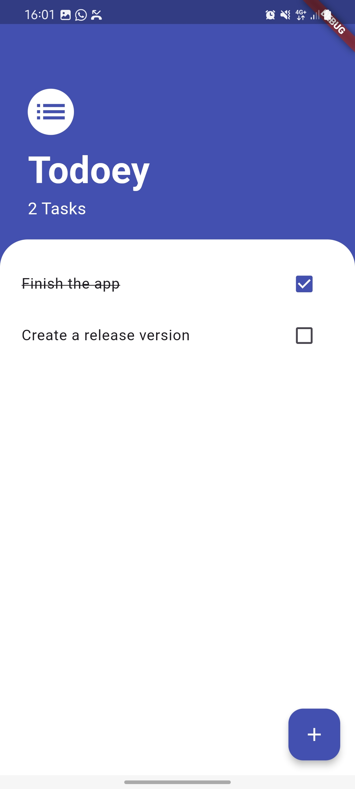
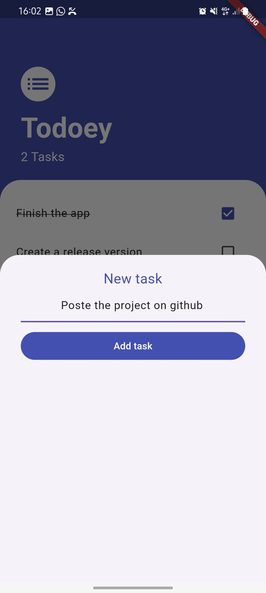

# 🚀 **Todoey - Task Manager App**

**Showcase of state management using Provider package.**

A simple yet powerful task management app built with Flutter and Provider for state management. Easily add, toggle, delete and track your tasks.

---

## 🔧 **Features**

- **Add Tasks**: Add tasks with just a tap.
- **Toggle Task Completion**: Mark tasks as done or undone.
- **Delete Task**: Delete tasks with just a long press.
- **State Management with Provider**: Easily manage and update the state of tasks.
- **Beautiful UI**: Clean and minimal design for smooth user experience.
- **Persistent Data**: Future updates can include saving tasks locally.

---

## 📂 **Installation**

Get the .apk file on the release and install ;

OR

Follow these steps to set up the project locally:

1. **Clone the repository**:
    ```bash
    git clone https://github.com/Imran-227/todoey.git
    ```

2. **Install dependencies**:
    ```bash
    cd todoey
    flutter pub get
    ```

3. **Run the project**:
    ```bash
    flutter run
    ```

---

## ⚙️ **Usage**

To run the project and start using it:

1. **Start your app**:  
   Run the command `flutter run` in your terminal.  
   The app will open on your default emulator or connected device.

2. **How to add a task**:
    - Tap the **+ button** to open a modal where you can add a new task.
    - Enter your task name and hit the **Add task** button.

3. **How to mark a task as done**:
    - Tap the checkbox next to a task to mark it as completed.
   
4. **How to delete a task**:
    - Press and hold (long press) on the task.

---

## 📸 **Screenshots**

### App Screenshot 1


### App Screenshot 2


---

## 🛠️ **Technologies Used**

- **Flutter**: For building cross-platform mobile apps.
- **Provider**: State management library used for managing app state.
- **Dart**: The programming language used for Flutter development.
- **Material Design**: Flutter's built-in widget library for creating beautiful UIs.

---

## 🔑 **Contributing**

We welcome contributions! Here's how you can help:

1. Fork the repository.
2. Create a new branch for your feature (`git checkout -b feature-name`).
3. Make your changes and commit them (`git commit -am 'Add new feature'`).
4. Push your changes and create a pull request.

---

## 📜 **License**

This project is licensed under the MIT License - see the [LICENSE](https://opensource.org/licenses/MIT) file for details.

---

## 👨‍💻 **Contact**

- **Imran Yayé**: [imyaye@gmail.com](mailto:imyaye@gmail.com)
- **GitHub**: [@Imran-227](https://github.com/Imran-227)
- **Website**: [linktr.ee/iltumate](https://linktr.ee/iltumate)

---

## 💡 **Acknowledgments**

- Special thanks to [Flutter](https://flutter.dev) for providing a beautiful UI toolkit.
- Special thanks to [Angela Yu](https://github.com/angelabauer) for The Complete 2020 Flutter Development courses.
- Inspiration for this project came from [The Complete 2020 Flutter Development Chapter 16](https://github.com/londonappbrewery/Flutter-Course-Resources).

---

### **Badge for Build Status (Optional)**

You can add badges to show the build status of your project:

[](https://github.com/Imran-227/todoey)

